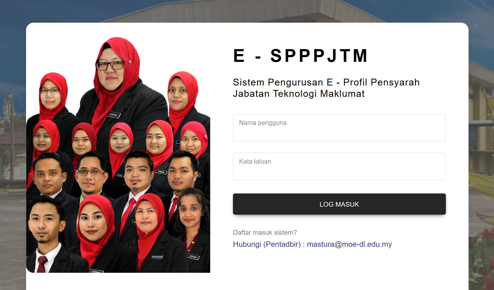

# SPPPJTM  
**Sistem Pengurusan Profil Pensyarah Jabatan Teknologi Maklumat**  
*(Lecturer Profile Management System – Information Technology Department)*

---

## 📌 Pengenalan

**Curriculum Vitae (CV)** ialah profil lengkap seseorang yang merangkumi:
- Latar belakang pendidikan  
- Kemahiran  
- Pengalaman kerja  

**Sistem Pengurusan E-Profil Pensyarah JTM (SPPPJTM)** dibangunkan sebagai platform berpusat untuk:
- Merekod dan mengemaskini maklumat CV pensyarah
- Menyeragamkan format CV
- Menjana laporan berkaitan pensyarah secara automatik

Ketua Jabatan boleh menjana laporan seperti:
- **Laporan Sangkutan Industri (LSI)**
- **Laporan Sijil Kemahiran Malaysia (SKM)**
- **Laporan Sijil Profesional**

---

## 🎯 Objektif Projek

- Menyediakan format CV yang **seragam** bagi semua pensyarah Jabatan Teknologi Maklumat  
- Memudahkan pensyarah merekod dan mengemaskini maklumat CV **setiap tahun**  
- Menyediakan **laporan analisis latihan sangkutan industri**  
- Menyimpan data pensyarah yang mempunyai:
  - Sijil Profesional Technologist  
  - Sijil Kemahiran Malaysia (SKM)

---

## ⭐ Kepentingan Sistem

- Memudahkan pengurusan dan pentadbiran Jabatan Teknologi Maklumat  
- Menjadikan data pensyarah lebih **tersusun, sistematik dan terkini**  
- Boleh digunakan oleh semua pensyarah tanpa bergantung kepada fail manual  

---

## ❗ Pernyataan Masalah

- Tiada keseragaman format CV yang digunakan  
- CV tidak dikemaskini mengikut tahun semasa dan tidak lengkap  
- Ketua Jabatan sukar mendapatkan:
  - Data terkini pensyarah  
  - Analisis dan laporan yang tepat  

---

## 🖼️ Paparan Sistem (Screenshots)

> Contoh antara muka sistem SPPPJTM:

---

## 🛠️ Teknologi Digunakan

- Backend: *PHP*
- Frontend: *HTML, CSS, Bootstrap*  
- Database: *MySQL*  

---
